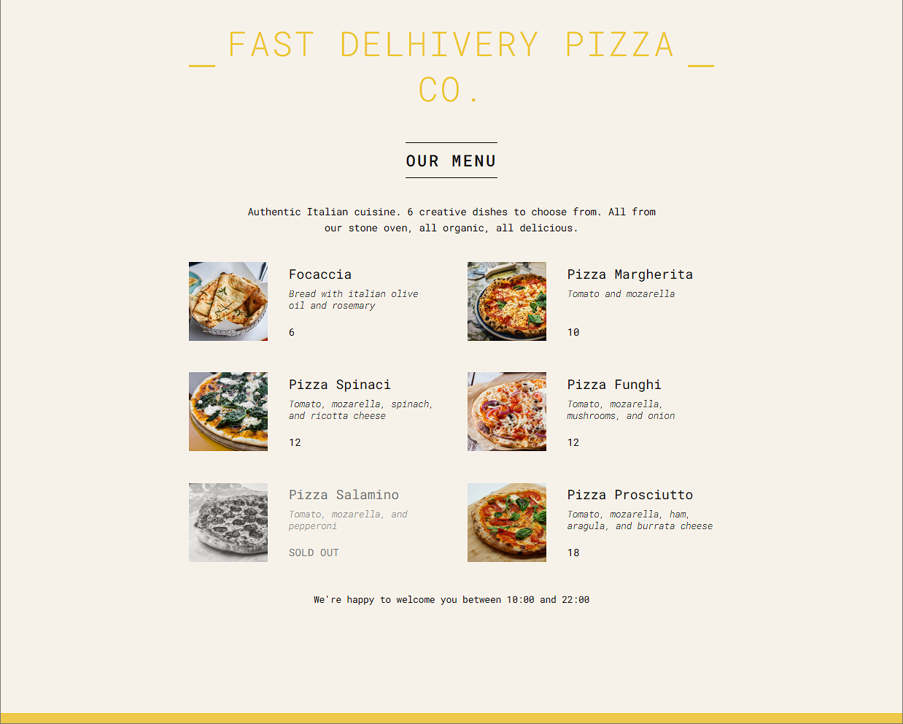

# REACT_PROJECT_1
A responsive React app showcasing a dynamic pizza menu with sold-out state handling and real-time open-hour logic.

# 🍕 Fast Delivery Pizza Co.

A simple and responsive React application showcasing a dynamic pizza menu. It includes real-time shop open/close logic and conditional rendering for sold-out items.

📸 Preview




🚀 Features

- Built with React.js using functional components
- Dynamic menu rendered from JavaScript objects
- Conditional rendering of "SOLD OUT" state
- Real-time open/close hour logic
- Minimal and clean UI with custom CSS

🛠️ Tech Stack

- React.js
- JavaScript (ES6+)
- HTML5 + CSS3

🧑‍💻 Getting Started

### Clone the repository:
```bash
git clone https://github.com/Amsir390/REACT_PROJECT_1.git
cd fast-pizza-menu
npm start

📁 Project Structure

pizza-menu/
│
├── public/
│   └── index.html
├── src/
│   ├── index.js
│   ├── App.js
│   ├── index.css
│   └── [components and assets]
│
├── package.json
└── README.md
```
## 📄 License

This project is licensed under the [MIT License](./LICENSE).

## 👨‍💻 Author

- GitHub: [@Amsir390](https://github.com/Amsir390)


